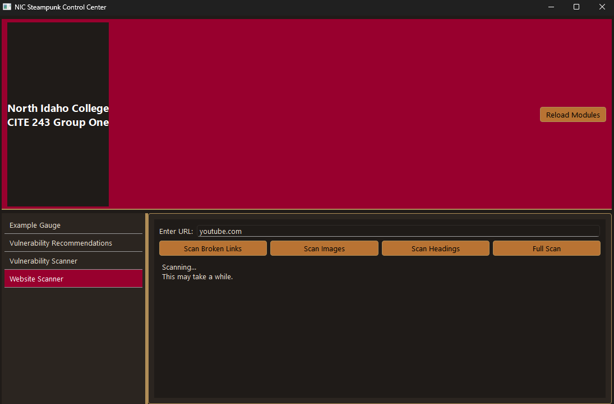
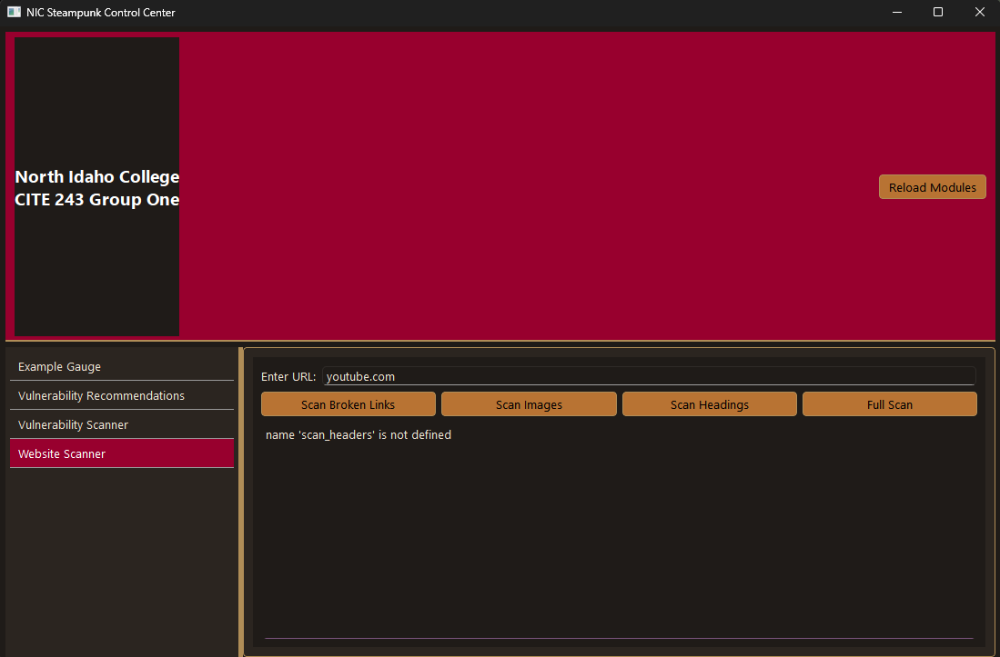
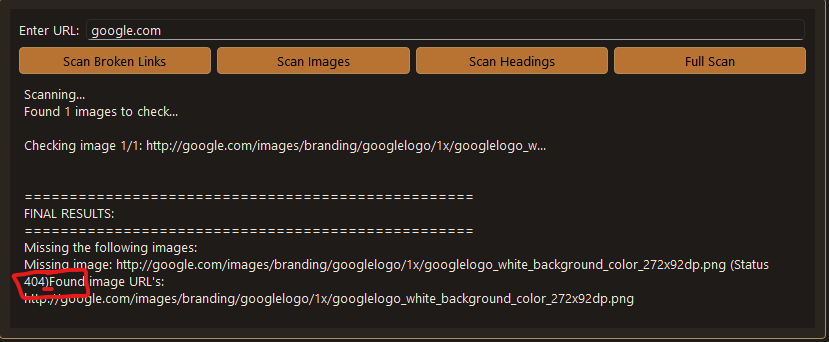
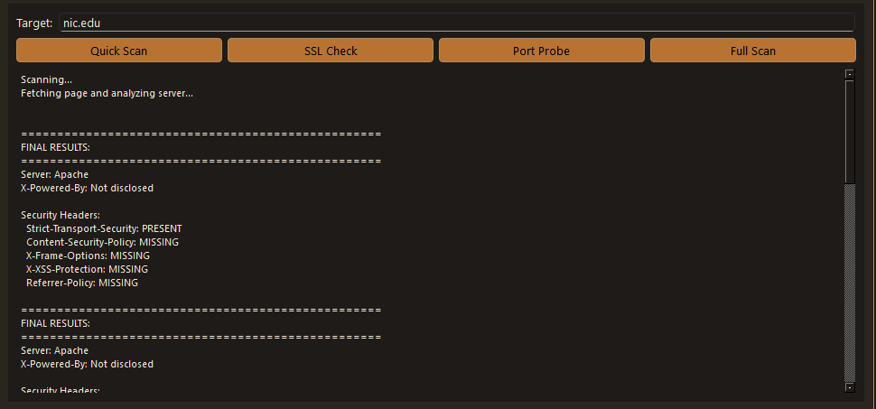

# 11/16/25

## General Ideas

Check for a comma in the url, it's an easy typo. It would be nice if that was pointed out to the user when they input a comma instead of a period.

If I click scan headers and then immediately click scan images, there is no indication which one is actually running. Other observation: when you click multiple buttons one after another, the outputs will show all clicked. For example:
		
If I click scan broken links, then scan images, then scan headings all right after another. The output goes in this order > 1. links 2. images 3. headings. Sometimes it will show the reverse order. It would be nice if it took only your last input and used that as the final choice. If you click the buttons too fast one after another, it may not register the last click from the looks of it.

## Vulnerability Scanner

### Port Probe

I inputed 8.8.8.8 into port probe and get results. If you just add a .8 to the end of that and repress the button, all the ports just change to closed, doesn't seem to try to reconnect for some reason. If I give it bogus input (asdfe), it returns all closed ports. Port probe does work on LAN services and IP's. I manually added port 53 in the code for testing pihole on my LAN, it did pick 53 up as open. Main issue for port probe it that it doesn't detect and invalid IP, it just shows all closed.

### Full Scan

Full Scan - If I do the same thing(above) for the full scan, the fingerprinting returns expected (Could not connect to server.) SSL returns expected (SSL check failed: [Errno 11001] getaddrinfo failed) Port Probe has the same issue, it says all ports are closed even though the address is invalid.

## Website Scanner

### Scan Broken Links

Tried google.com, it worked, but the resulting URL it says it checks is http://google.com, NOT https. This seems to be the case for every site. Browser will automatically upgrade to https, so not a huge deal. If you manually put https:// then the output will have https://, but only if you specify in the input. 

### Full Scan

When inputting a valid URL (youtube.com), I get "name 'scan_headers' is not defined" as the output. I tried Google.com and got the same thing. When I first press Full Scan with a good url, it does say Scanning... | This may take a while. It does this before the scan_headers output. I tried 1.1.1.1 and got the exact same output. Scanning... and then scan_headers is the result. 

First output for web scan > full scan
<!--No_Progress-->


name 'scan_headers' is not defined pictured below
<!--Scan_Headers-->



These screen shots were taken about 5 seconds apart.
I need to test more edge cases here soon.

# 11/17/25

## Fixed Some Bugs

I fixed the port probe bug we had. All I had to do was add a try/except clause to test connection right after the function was called. It was very simple as we had used the same try/except clause in other modules to prevent this bug. Here was the few lines of code I added below:
```python
try:
    r = requests.get(url, timeout=10)
except Exception:
    return "Could not connect to server."
```

**Matthew** also fixed the scan headers bug as well. That feature now works as expected. 

# 11/18/25

## More Testing

###  Patch 5

I just tried patch 5, and the vulnerability scanner doesn't work anymore. If I put in anything at all, I get the following:

| Quick Scan                                                                  | SSL Check                                                          | Port Probe                                                          | Full Scan                                                          |
|-----------------------------------------------------------------------------|--------------------------------------------------------------------|---------------------------------------------------------------------|--------------------------------------------------------------------|
| fingerprint_server() got an unexpected keyword argument 'progress_callback' | ssl_check() got an unexpected keyword argument 'progress_callback' | port_probe() got an unexpected keyword argument 'progress_callback' | full_scan() got an unexpected keyword argument 'progress_callback' |

I re-ran the requirements.txt incase there were any changes as well.

### Website Scanner

You are now able to see progress as the program checks through the different subdomains. This is a nice addition.


# 11/20/25
### Minor Formatting Bug
There's a very minor formatting bug when there is a missing image. The 'status 404' message is butted right up against the 'Found image URL' message. There should be a space or newline between the two.
  
Image below:
<!--Formatting-->


This also appears in the full scan output when an image is missing, as it calls the same function.

### Bogus Directory Bug

For both modules, if you put a valid domain name (google.com) but an invalid subdirectory (google.com/.,.asoea.a,f#%^*(@^#), the program will still run and return results. It would be better if it returned an error message saying the URL is invalid or could not be reached. Right now, it just runs and gives results as if the URL was valid, but it only looks at the top level domain even though the directory can't exist. This could simulate false positives if a user is trying to scan a specific directory that doesn't exist(easy typos return the exact same results).

Image below:
<!--Bogus Direcory-->


### Rapid Input Bug

While spam clicking quick scan, it registers multiple inputs. For example, I spam clicked quick scan 3 times in a row, and it ran the scan 3 times, returning 3 sets of results. It would be better if it only registered the last click, or disabled the button while a scan is running. The output is the same for every scan, it just duplicates the results.

Image below(notice the scrollbar):
<!--Rapid_Input-->


I could get this to happen with the following buttons:
#### Vulnerability Scanner
Quick Scan\
SSL Check\
Port Probe\
Full Scan
#### Website Scanner

Scan Broken Links\
&nbsp;&nbsp;&nbsp;&nbsp;(*This was especially bad because I tried google.com, which has 17 links to check. It tried all 17 a total of 7 times. It was very slow*)
Scan Images\
Scan Headings\
Full Scan (Website Scanner)\
&nbsp;&nbsp;&nbsp;(*This was also especially bad because it ran all 3 scans multiple times. It was very slow as well.*)

#### Conclusion for Rapid Input Bug
It happens on every button in both modules. It would be best to disable the buttons while a scan is running to prevent this from happening.


